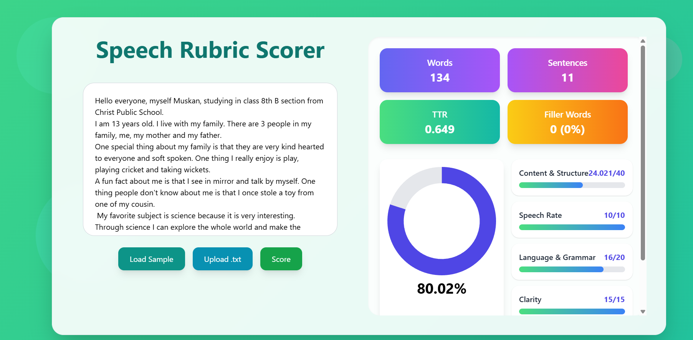

# Speech-Evaluator
Simple Flask app that scores a spoken transcript (or pasted text) against a rubric (Excel workbook).
It provides a web UI, a JSON scoring endpoint, and an Excel report download.

---

## Features

- Paste a transcript or upload a `.txt` file.
- Provide duration (seconds) — used to compute WPM (words per minute).
- Computes per-criterion scores using:
  - Rule-based keyword & length checks
  - NLP semantic similarity (optional; sentence-transformers if installed)
  - Data-driven weighting per rubric to combine signals into final scores
- UI shows overall score, word count, sentence count, per-criterion breakdown, and a downloadable Excel `Results` sheet.

---
## Quick start (dev)

> tested with Python 3.10+. Create a virtual environment, install requirements and run the app.

1. create & activate venv
python -m venv venv
venv\Scripts\activate   (Windows)  or  source venv/bin/activate

2. install
pip install -r requirements.txt

3. download nltk punkt
python -c "import nltk; nltk.download('punkt')"

4. create rubrics.csv
python convert_rubric.py

5. run app
python app.py

6. open http://127.0.0.1:5000 in browser

Deployment link: https://speechevaluator.onrender.com

